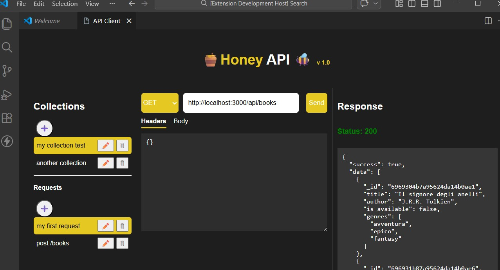
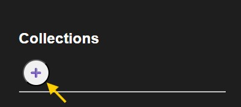
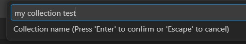
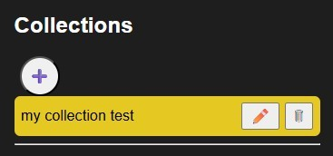
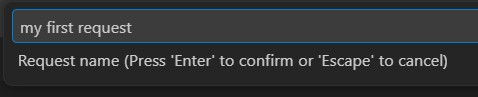
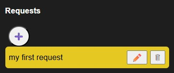
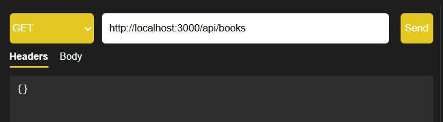
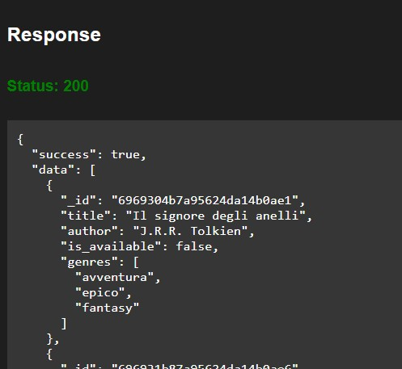

# 🍯 Honey API 🐝

**Honey API** is a sleek, lightweight API client built **directly inside VS Code**.  
Test your REST APIs effortlessly, organize your requests, and stay in your coding flow — no external tools needed.

---

## 🚀 Latest Updates (v1.0.2)

### Improvements
- Collections are now **global** (shared across all VS Code windows)
- Automatic cleanup of legacy workspace data

### Fixes
- Response panel now scrolls correctly
- Deleting a request updates the UI immediately
- Deleting a collection now removes all related requests from the UI

### UX Enhancements
- Warning message when trying to send a request without selecting one

---

## 🌟 Why Use Honey API?

- Stay **inside VS Code** — no switching between apps  
- **Organize requests** into Collections for different projects  
- Send **HTTP requests** quickly (GET, POST, PUT, DELETE)  
- Customize **Headers & Body** for every request  
- **View responses instantly**, color-coded for success/failure  
- Persistent workspace storage — your Collections & Requests stay saved

---

## 🔹 Key Features

- **Collections & Requests**
  - Create multiple collections for different projects
  - Add, rename, delete requests within collections
  - Highlight active collection/request for clarity
- **Request Editor**
  - Full HTTP method support: GET, POST, PUT, DELETE
  - Headers & JSON body editor
  - Prettified JSON response output
- **Response Viewer**
  - Status highlighted: green = success, red = error
  - Scrollable, readable, and persistent
- **Three-panel intuitive UI**
  1. Left: Collections & Requests
  2. Center: Request configuration (URL, Method, Headers, Body)
  3. Right: Response & status

---

## 🚀 How to Use Honey API

### 1️⃣ Open the Client
- Press `Ctrl+Shift+P` (Windows/Linux) or `Cmd+Shift+P` (Mac)  
- Type `Open Honey API` and select it  
- The webview opens with three panels

### 2️⃣ Manage Collections
- Click **+ Collection** to create a new project collection  
- Click a collection to select it; rename or delete if needed  
- Active collections are highlighted in green  

### 3️⃣ Manage Requests
- With a collection selected, click **+ Request**  
- Enter request name, URL, Method, Headers, Body  
- Select a request to edit it  
- Rename, modify, or delete requests anytime  

### 4️⃣ Send a Request
- Configure URL, Method, Headers, Body  
- Click **Send**  
- Response appears in the right panel with **status color-coded**  
- JSON responses are automatically prettified  

---

## ⚡ Notes

- **Workspace state storage** ensures your collections and requests persist across sessions  
- No external servers required — all requests are sent from the extension’s Node.js backend  

---

## 📸 Mini tutorial screenshots

1. Add a new collection:

2. Add a new request:

3. Compile the selected request with method, url and click send button:

4. In the right panel you can see the response details:

---

## 📜 License

MIT License. See [LICENSE](LICENSE)  